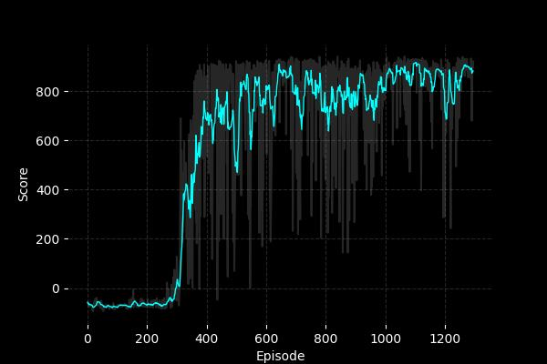
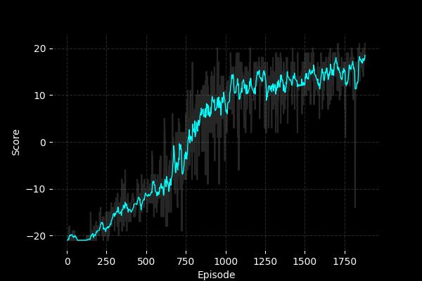
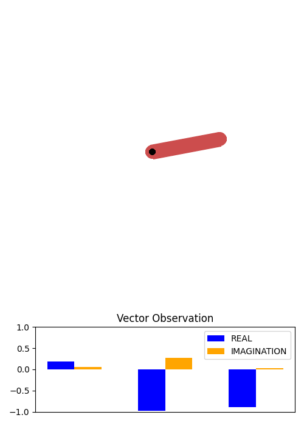
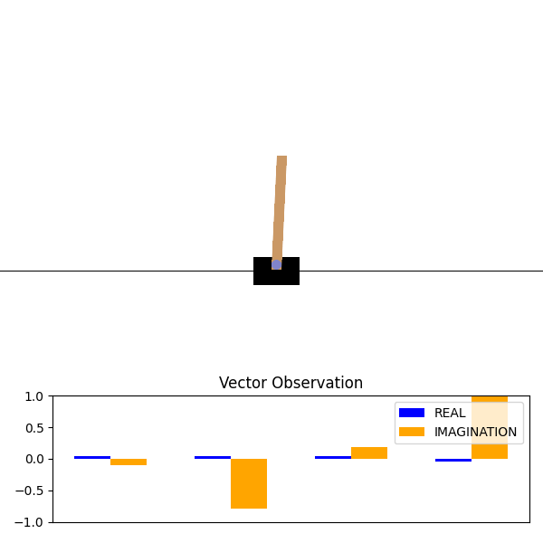

# TrustworthyDreamer

<!-- Tested and easy-to-read version of DreamerV3, 100% in PyTorch. This README also includes a detailed explanation of the algorithm, assuming you only know basic concepts of RL. -->

DreamerV3 is a state-of-the-art model based RL algorithm that uses **experiences** to train a **world model**, and uses the **world model** to learn a **policy**. In other words, it uses real interactions to learn the dynamics of the world, and then imagines the dynamics of the world to learn what to do. However, both the original paper and code are [extremely hard to read](https://www.reddit.com/r/reinforcementlearning/comments/1azgrc4/dreamerv3_code_is_so_hard_to_read/), as pointed out by several people, even for those already familiar with model-free RL.

More recently, several researchers implemented their own version of the algorithm, some aiming for performance, and others aiming for simplicity. From these, I stand out the implementation of [InexperiencedMe](https://github.com/InexperiencedMe/NaturalDreamer/tree/main) (named **NaturalDreamer**), who also provides a [tutorial](https://www.youtube.com/watch?v=viXppDhx4R0) which I highly recommend. However, as the author warns, **NaturalDreamer** deviates from the original DreamerV3, since it is an oversimplification of the algorithm. **NaturalDreamer** does not handle vector observations and discrete actions, and also does not implement a range of tricks which stabilize and speed up learning:

||Implementation|Vector Observations|Image Observations|Discrete Actions|Continuous Actions|Advantage Normalization|Symlog Observations|Bins Network|Soft Critic|Repval Loss|Recurrent Blocks|Replay Context|LaProp Optimizer
-|-|-|-|-|-|-|-|-|-|-|-|-|-
DreamerV3|JAX|✓|✓|✓|✓|✓|✓|✓|✓|✓|✓|✓|✓
NaturalDreamer|PyTorch||✓||✓|✓
TrustworthyDreamer|PyTorch|✓|✓|✓|✓|✓|✓|✓|✓|✓||✓|✓

Trick|Description
-|-
Advantage Normalization|At every training step, the returns and advantages used in the actor and critic losses are normalized according to their scale, stabilizing the loss across environments with different reward scales.
Symlog Observations|When observations are vectors, the symlog transformation squeezes large negative and positive values, stabilizing observations across environments with different observation scales.
Bins Network|In networks that predict scalar values (i.e., critic and reward networks), outputting a single value can produce large gradients because of MSE loss. One way to fix this is by having a network that has $B$ outputs (bins), where each bin corresponds to one specific value. To be able to predict any continuous value through this type of output, the network outputs a softmax probability over bins, with the actual scalar being a weighted average. By training the network through categorical cross entropy, we eliminate the existence of large gradients.
Soft Critic|By having a target critic network that is updated using the *Polyak averaging*, we stabilize target critic predictions.
Repval Loss|Although we can train the critic network only on imagined reward predictions, we can also train it based on real rewards (with a smaller weight), sticking critic predictions to both imagination and reality. This can only be used when we have real interactions in memory.
Recurrent Blocks|The heart of the world model in DreamerV3 consists of a recurrent network, and this is what makes it possible to imagine future states. While this network can simply consist of a single large recurrent layer (e.g., LSTM or GRU), DreamerV3 uses smaller independent GRU layers that can capture different aspects of the dynamics, while having less parameters than a single large one.
Replay Context|For training, sequential experiences from a single episode (small trajectories) are sampled from memory. If the first experience of a trajectory starts at the middle of an episode, the agent should have a context of what happened since the beginning of the episode. Because of this, we must not only save that context in memory for each experience, but also update it after each training step, since the representation of the context also changes with time.
LaProp Optimizer|Although the Adam optimizer works perfectly fine for most environments, LaProp aims to fix some instabilities found in Adam.

**TrustworthyDreamer** uses some of the code found in **NaturalDreamer**, but also builds upon that to include all the missing points mentioned above. Results show that **TrustworthyDreamer** is able to learn faster than **NaturalDreamer** in CarRacing-V3 (the only tested environment), while also being able to solve other tasks involving vector and image observation spaces, as well as discrete and continuous action spaces, **all without changing hyperparameters**.

# Tested Environments

Environment|Mean Score|Max Score|Training Time
-|-|-|-
Car Racing|$817.02 \pm 195.34$|$938.10$|~9 h
Pong|$18.85 \pm 1.97 $|$21$|~14 h
Cartpole|$455.15 \pm 51.15$|$500.00$|~2 h 30 min
Pendulum|$-179.97 \pm 105.88$|$-1.67$|~2 h 30 min

## Car Racing (Image observations, Continuous actions)




## Pong (Image observations, Discrete actions)




## Pendulum (Vector observations, Continuous actions)



## Cartpole (Vector observations, Discrete actions)



# How does DreamerV3 work?

In this section I will explain, using simple examples, the main idea in how DreamerV3 attempts to model the past, the uncertainty, and the future through each component. At the end of this section, you will have an idea what *dreaming* means in DreamerV3, and how is that different from actual *interaction*.

##  Information about the past - $h_t$
First of all, at any timestep inside an episode (dreaming or not), the agent contains a history related to what happened since the beginning of the episode, represented by a vector $h_t$. At the beginning of the episode, the vector is full of zeros (there is no past). This vector is normally large (the author defines it with size $D = 1024$), which is probably enough to represent the past for long episodes.

How we get to this value at each step does not matter for now, just understand that $h_t$ represents **all that happened since the start of an episode**.

For instance, if the agent is currently in step $t=3$, then $h_t$ summarizes all observations $(x_0, x_1, x_2)$, all actions $(a_0, a_1, a_2)$ and all rewards $(r_0, r_1, r_2)$. Not only that, it also summarizes past uncertainty, as you'll see ahead.

## Uncertainty about the past - $z_t$

While $h_t$ summarizes the past, $z_t$ represents the current uncertainty given the past ($h_t$). That is, given what happened ($h_t$), what am I currently uncertain about ($z_t$)?

The way that DreamerV3 models this uncertainty is particularly interesting, and I'm going to make an analogy that allows us to understand very simply what $z_t$ is. Don't take this analogy as a **fact** (because it's not), but an idea that simplifies a lot how you look at $z_t$.

DreamerV3 states that **any RL environment has $S=32$ uncertainties at any moment, each with $C=64$ possible levels of uncertainty**.

Suppose you just started playing Minecraft with your friend, and you're both breaking the same tree. Suddenly, your friend goes behind your back and you can't see where they are. Currently, there is a high uncertainty about the actual position of your friend (say, level 63 of uncertainty), so you turn around to see where they actually are. At this moment, there is another uncertainty, which is the position of the tree that is now behind you. However, this uncertainty is very low (say, 0), because trees don't move. This is what $z_t$ attempts to model:

$$
z_t =
\underbrace{
\begin{bmatrix}
0 & 0 & \dots & 1 \\
\vdots & \vdots & \ddots & \vdots \\
1 & 0 & \dots & 0
\end{bmatrix}
}_{\text{$C$ levels of uncertainty}}
\;
\left.
\begin{matrix}
\\[2pt] \\[2pt] \\[2pt] 
\end{matrix}
\right\}
\text{$S$ uncertainties}
$$

Therefore, $z_t$ is a matrix with $S$ rows that are one-hot encoded (representing the level of each uncertainty). In practice, each row represents a sample from a Categorical distribution with $C$ classes.

Now, this uncertainty becomes a bit more accurate when we have access to both the past information ($h_t$) and the current observation ($x_t$), that is, the uncertainty **posterior** to knowing the observation ($x_t$):
$$
z_t \sim p_\phi(z_t \mid h_t, x_t)
$$

However, since we only have access to observations when we interact with the environment, our main objective is to learn the same uncertainty, but **prior** to having observations:
$$
\hat{z}_t \sim p_\phi(\hat{z}_t \mid h_t)
$$

Learning this **prior** is what enables us to *imagine* future states, because we don't need observations to know the uncertainty ($z_t$). In simple terms, the **posterior** produces the target that the **prior** is trying to learn (this is also why samples of the **prior** are commonly written with a hat, $\hat{z}_t$, since they are just predictions based on the real target, $z_t$).  You can also think of it like this:
- The **posterior** ($z_t$) attempts to predict how an object will move by having access to how the object moved in the past ($h_t$) and the current position of the body ($x_t$);
- The **prior** ($\hat{z}_t$) attempts to predict how an object will move knowing only how it moved in the past ($h_t$).

This is why the **prior** is called the "*dynamics predictor*" by the author of DreamerV3. The **prior** learns the underlying dynamics of an environment.

This makes us kind of remember our *dreams*, right? When we are awake, our sense of how the world works is supported by both our memory ($h_t$) and what we see ($x_t$), but when we dream, we only have access to our memory ($h_t$). That's why some weird stuff ends up happening in our dreams the more we stay within it, as the dynamics that we are experiencing are not supported by real evidence ($x_t$). Nonetheless, what we dream (**prior**) is based on what we experienced when we were awake (**posterior**), so we consider the **posterior** as the target.

## Model State - $s_t = (h_t, z_t)$

The concatenation of the past information ($h_t$) with the current uncertainty ($z_t$) is what creates the **model state** ($s_t$) vector. Since $z_t$ is a matrix of dimension $S \times C$, we flatten it to become a vector of dimension $SC$.

This state is equivalent to a state in model-free RL. That is, we use $s_t$ as input for the actor network, $a_t \sim \pi_\theta(s_t)$ to get actions, and the critic network, $R_t = V_\theta(s_t)$ to get returns. Not only this, we also use $s_t$ in other networks to simulate interactions with the environment, which are needed for imagination. 

Typical interactions with the environment gives us the next state, rewards, and termination signals:
```py
observation, reward, is_terminal, is_truncated, _ = env.step(action)
```

For imagination, we have separate models that give us the next state, reward, and continuation signal (opposite of termination signal):
Component|Function|Description
-|-|-
`observation` | $h_t = f_\phi (s_{t-1}, a_{t-1})$ | Sequence Model
`reward` | $\hat{r}_t \sim p_\phi(\hat{r}_t \mid s_t)$ | Reward Predictor
`continue` | $\hat{c}_t \sim p_\phi(\hat{c}_t \mid s_t)$ | Continuation Predictor

With these components, we can simulate interactions with the environment, which produce stochastic (probabilistic) results, just like real interactions. Rewards and continuation flags are samples from the reward and continuation predictors, and although the sequence model is deterministic, the uncertainty inside $s_t$ ($z_t$) is created based also on a sample from the **prior** at each step, $\hat{z}_t \sim p_\phi(\hat{z}_t \mid h_t)$.

## Sequence Model - $h_t = f_\phi (s_{t-1}, a_{t-1})$


The **sequence** model is just the model that updates the past information vector ($h_{t-1} \rightarrow h_t$) given new information about the uncertainty ($z_{t-1}$) and the action ($a_{t-1}$). The **sequence** model is what allows us to transition into the future, whether assuming **posterior** uncertainty, or **prior** uncertainty. Therefore, the **sequence** model is used both on interaction with the environment and on imagination.

In practice, the author assumes that this model is a single recurrent layer (GRU), which is able to model past information better than MLPs by its "hidden state".
<!-- 
## Prediction of Reward and Continuation - $\hat{r}_t$ and $\hat{c}_t$

As we attempt to learn how the world works (**prior**), we also attempt to learn what is the reward of each action, and if the action will place the agent in a terminal state. Therefore, DreamerV3 contains two additional models that are trained to predict exactly that based on real experiences. On imagination, the actual reward the agent gets for being in a state  -->

## Decoder - $\hat{x}_t$

Although DreamerV3 uses this in the paper for the purpose of **showing how dreams look like visually**, training a model that reconstructs an observation ($x_t$) based on the model state ($s_t$) actually helps creating more informative states $s_t$. We call this model the **decoder**.

This may be difficult to grasp, but including a "*reconstruction loss*" to the total loss that is being minimized, will not only optimize the **decoder** parameters for better reconstructions, but also train how the representation $s_t$ can be changed for easier reconstructions. Why do we want informative states $s_t$? Because by having them, we can have more informative inputs for all other networks, including the actor and the critic.

## Interaction vs. Imagination

So, from here, you can already have an idea of how the model **interacts** with the environment, and how it **imagines**. Let's go step by step in each scenario.

### Interaction (Awake)
Step ($t$)|Action|Operation
-|-|-
0|Initialize $h_0$|$h_0 = (0, 0, \dots, 0)$
0|Initialize $z_0$|$z_0 =\begin{bmatrix}0 & 0 & \dots & 0 \\\vdots & \vdots & \ddots & \vdots \\0 & 0 &\dots & 0\end{bmatrix}$
0|Initialize $a_0$|$a_0 = (0, 0, \dots, 0)$
0| Get first observation $x_0$|`x_0 = env.reset()`
1|Take action $a_0$|`x_1, r_1, d_1 = env.step(a_0)`
1|Get $h_1$ from **sequence**|$h_1 = f_\phi(h_0, z_0, a_0)$
1|Get $z_1$ from **posterior**|$z_1 \sim p_\phi(z_1 \mid h_1, x_1)$
1|Create state $s_1$|$s_1 = (h_1, z_1)$
1|Save experience|$(x_0, a_0, r_1, d_1, s_1)$
1|Sample action $a_1$|$a_1 \sim \pi_\theta(s_t)$
2|Take action $a_1$|`x_2, r_2, d_2 = env.step(a_1)`
$\dots$|$\dots$|$\dots$

### Imagination (Dreaming)
Step ($t$)|Action|Operation
-|-|-
0|Initialize $h_0$|$h_0 = (0, 0, \dots, 0)$
0|Initialize $\hat{z}_0$|$\hat{z}_0 =\begin{bmatrix}0 & 0 & \dots & 0 \\\vdots & \vdots & \ddots & \vdots \\0 & 0 &\dots & 0\end{bmatrix}$
0|Initialize $a_0$|$a_0 = (0, 0, \dots, 0)$
1|Get $h_1$ from **sequence**|$h_1 = f_\phi(h_0, z_0, a_0)$
1|Get $\hat{z}_1$ from **prior**|$\hat{z}_1 \sim p_\phi(\hat{z}_1 \mid h_1)$
1|Create state $s_1$|$s_1 = (h_1, \hat{z}_1)$
1|Sample reward $\hat{r}_1$|$\hat{r}_1 \sim p_\phi(\hat{r}_1 \mid s_1)$
1|Sample continuation $\hat{c}_1$|$\hat{c}_1 \sim p_\phi(\hat{c}_1 \mid s_1)$
1|Sample action $a_1$|$a_1 \sim \pi_\theta(s_t)$
2|Get $h_2$ from **sequence**|$h_2 = f_\phi(h_1, \hat{z}_1, a_1)$
2|Get $\hat{z}_2$ from **prior**|$\hat{z}_2 \sim p_\phi(\hat{z}_2 \mid h_2)$
$\dots$|$\dots$|$\dots$

Although here we don't use the imagined rewards ($\hat{r}_t$) and imagined continuations ($\hat{c}_t$) for anything, they are used to train the actor and critic networks, which is **much** faster and efficient than directly interacting with an environment.